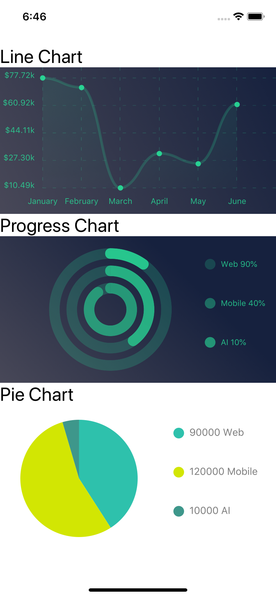

# React Native Chart App
The App displays 3 charts. Line chart, Progress Chart and Pie Chart. All in similar colors.
<div align="center" style="background: #d9d9d9;">
  
</div>

### REQUIREMENTS

This project requires the following:
 * [Node](https://nodejs.org/en/)
 * [Expo](https://expo.io/)

### INSTALLATION
To install and run this app you will need to have Node.js and Expo installed on your device. You can download them from the links above.

After that you can clone this repo:
```bash
git clone https://github.com/markokarapandzic/react-native-chart-app.git 
```
When you download the project, install all Node dependencies:
```bash
npm install or yarn install
```
And to run your project, just run Expo:
```bash
expo start
```
### TECHNOLOGIES USED

Here is a list of technologies used to build this project.
* HTML
* CSS
* React-Native
* [Expo](https://expo.io/)
* [NPM](https://www.npmjs.com/) - Package Menagement
* [Git](https://git-scm.com/) - Version Control

### AUTHOR
* **Marko Karapandzic**
See my other projects on my [GitHub](https://github.com/markokarapandzic) account.
Check out my [Website](https://markokarapandzic.github.io/portfolio-website/).
### LICENSE
No Licence